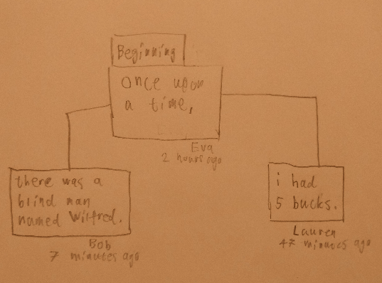

# Story Tree
A written game of [exquisite corpse](https://en.wikipedia.org/wiki/Exquisite_corpse).

This collaborative storytelling game starts 
with the user creating a story tree. \
At its root, it has the beginning of a story, such as

> Once upon a time

Other users can add a sentence to it. \
A story tree can branch out into many different stories
that spin off to substories.

##### Users can
- Create a story tree.
- Invite their friends to collaborate on a story tree.
- Continue any story from where their friends left off.

##### System
- A story tree is a tree where the beginning is the root node,
  and every subtree is a story.
- Users can add a new node, a sentence in the story. \
  They can add it to any node that is not their own.
- Users cannot delete or edit nodes.